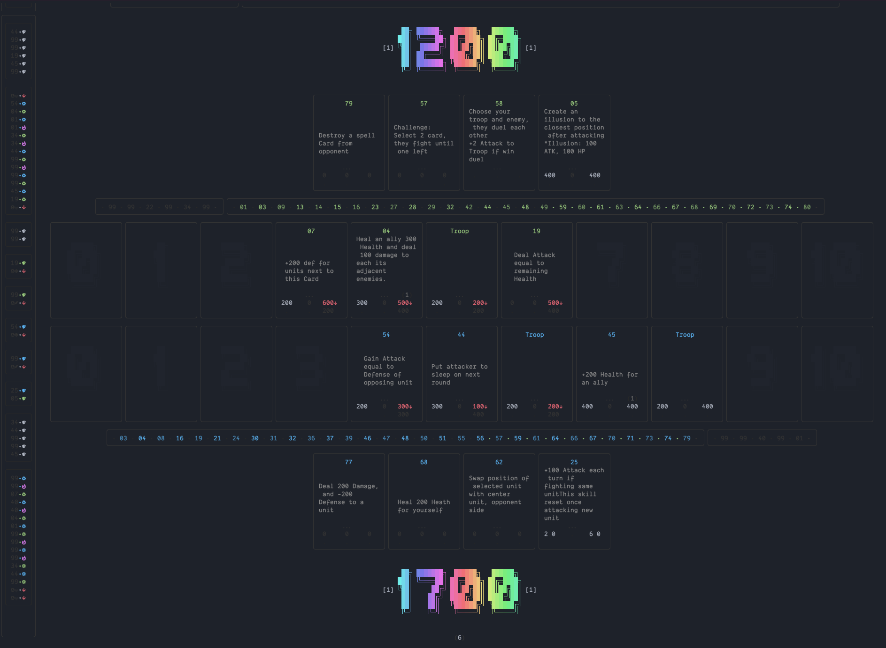

# Important! This repo has been relocated:
This repo will keep as-is with current implementation. Further upgrade will happen under [Under Realm](https://github.com/cocrafts/UnderRealm) mono repo.

# Mono repo for Games algorithm:
Single repository that hold opensource algorithm for Metacraft Games.

## Required tools:
- [NodeJs](https://nodejs.org/en/), suggested version 16
- Install `metacraft cli` via `npm i --location=global metacraft` or via yarn `yarn global add metacraft` 

## Development:
Run `yarn client` under project's root directory for Development - if success you would see something like following:

## Game Server
There is an sample implementation under `tool/murg-sever`, launch it with `yarn server`.

